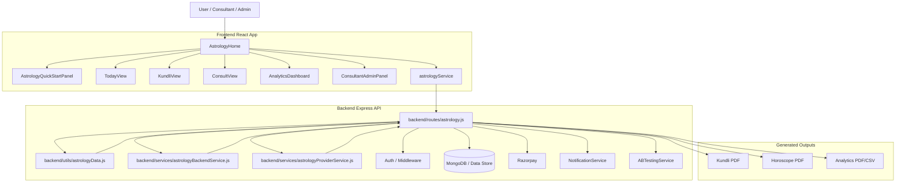
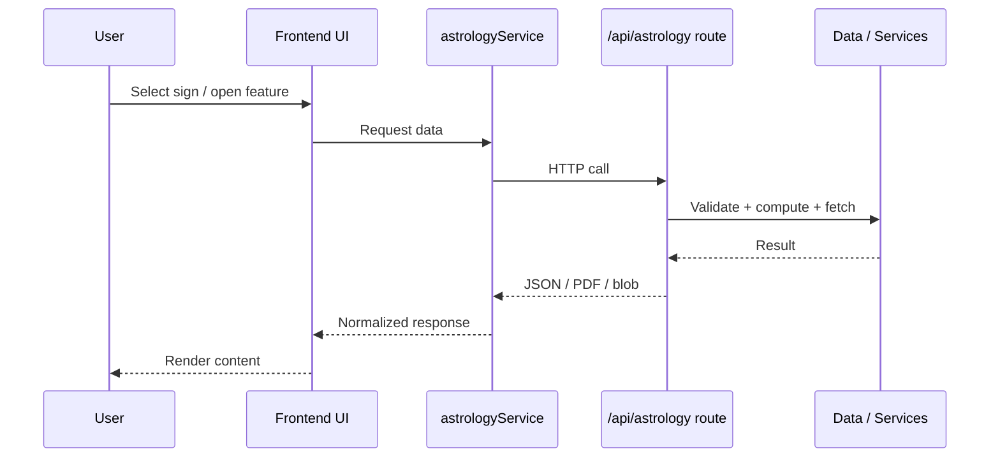

# AstroNila Astrology Module Architecture Diagram

## High-level overview

## Component responsibilities

### Frontend
- **AstrologyHome**  
  Main entry screen that orchestrates the module tabs, profile state, and sign selection.
- **AstrologyQuickStartPanel**  
  Fast onboarding for profile and initial astrology actions.
- **TodayView**  
  Displays daily horoscope, guidance, panchangam, and report actions.
- **KundliView**  
  Handles birth-data-based astrology, charts, and Kundli export.
- **ConsultView**  
  Lets users book consultations and manage consultation flows.
- **AnalyticsDashboard**  
  Admin-only dashboard for operational analytics and exports.
- **ConsultantAdminPanel**  
  Consultant/admin dashboard for bookings, availability, and profile editing.
- **astrologyService**  
  API client and fallback-data layer for frontend requests.

### Backend
- **routes/astrology.js**  
  Main API router for astrology-related endpoints.
- **utils/astrologyData.js**  
  Zodiac metadata and deterministic horoscope generation.
- **services/astrologyBackendService.js**  
  Core business logic for astrology calculations, reports, analytics, and booking helpers.
- **services/astrologyProviderService.js**  
  External provider integration with fallback behavior.
- **middleware/auth**  
  Authentication and authorization guard.
- **MongoDB / Data Store**  
  Stores profiles, bookings, consultant data, and operational records.
- **Razorpay**  
  Handles payment order creation and verification.
- **NotificationService**  
  Sends booking confirmations and consultant notifications.
- **ABTestingService**  
  Tracks experiments and user variants.

## Request flow

1. User interacts with the astrology UI.
2. Frontend calls `astrologyService`.
3. Service sends HTTP requests to `/api/astrology/*`.
4. Backend validates auth and request payloads.
5. Route delegates to services, storage, or providers.
6. Response is normalized and returned to the UI.
7. UI renders live data or fallback content.

## Data flow by feature

### Daily horoscope
`User -> AstrologyHome -> astrologyService -> /api/astrology/daily/:sign -> astrologyData -> response`

### Profile save
`User -> Profile form -> astrologyService -> /api/astrology/profile -> MongoDB`

### Kundli generation
`User -> KundliView -> astrologyService -> /api/astrology/kundli -> astrologyBackendService -> PDF/data`

### Consultation booking
`User -> ConsultView -> astrologyService -> /api/astrology/consultations/book -> DB + NotificationService`

### Payments
`User -> consultation payment -> astrologyService -> /api/astrology/consultations/:bookingId/payment/* -> Razorpay + DB`

### Analytics
`Admin -> AnalyticsDashboard -> astrologyService -> /api/astrology/analytics/* -> aggregation + export`

## Mermaid sequence diagram

## Notes

- The module is built as a full-stack feature, so the frontend and backend should be changed together.
- PDF and CSV exports are handled server-side.
- Fallback data is used when external providers are unavailable.
- Admin-only and consultant-only paths rely on role checks in the backend and UI.

## Related docs

- `docs/astrology-user-manual.md`
- `docs/astrology-technical-reference.md`
